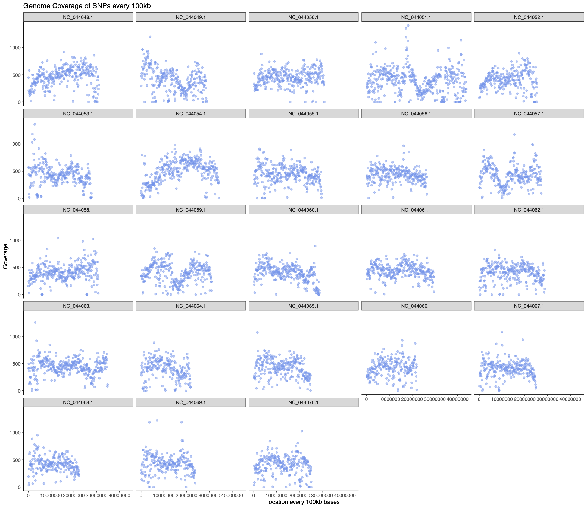

# Visualize SNP coverage 
Use the bedtools makewindows function to identify windows of a specific size across the genome. Then use this file to calculate the number of snps found within that window using bedtools coverage. 

```
#!/bin/bash
#SBATCH --job-name=bedtoolsCoverage
#SBATCH --mem=100GB
#SBATCH --mail-user=schaal.s@northeastern.edu
#SBATCH --mail-type=FAIL
#SBATCH --partition=lotterhos
#SBATCH --time=10:00:00
#SBATCH --cpus-per-task=1
#SBATCH --output=clustOut/bedtoolsCoverage.%j.out
#SBATCH --error=clustOut/bedtoolsCoverage.%j.err
source ~/miniconda3/bin/activate lotterhos_utils_sara
bedtools makewindows -g chrom.sizes.txt -w 150000 > windows150kb.bed
bedtools coverage -a windows150kb.bed -b merged.f.99ind.MAF05.vcf -counts > coverage150kb.txt

```

```
Job ID: 18561452
Cluster: discovery
User/Group: schaal.s/users
State: COMPLETED (exit code 0)
Cores: 1
CPU Utilized: 00:03:27
CPU Efficiency: 99.04% of 00:03:29 core-walltime
Job Wall-clock time: 00:03:29
Memory Utilized: 63.73 GB
Memory Efficiency: 63.73% of 100.00 GB
```

use vcfCoverageCheck.R script to make graphs.

  
  
  