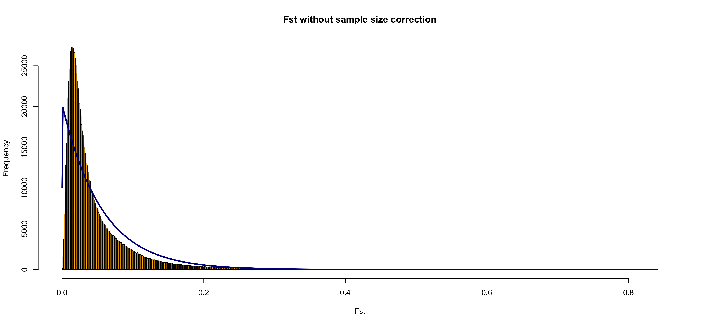
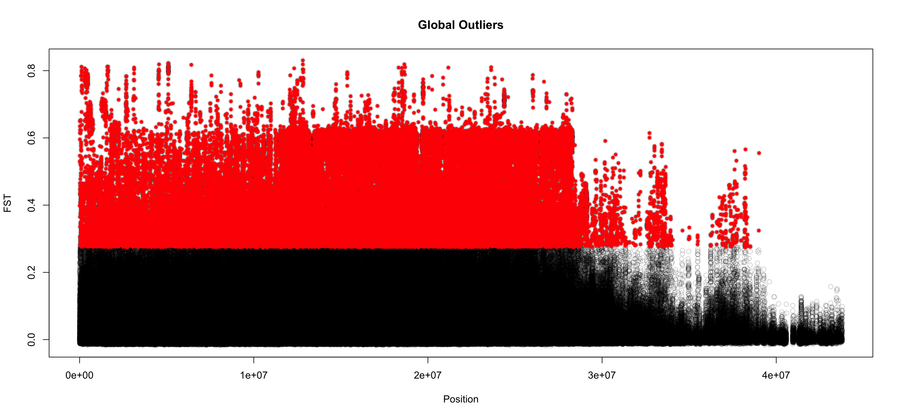
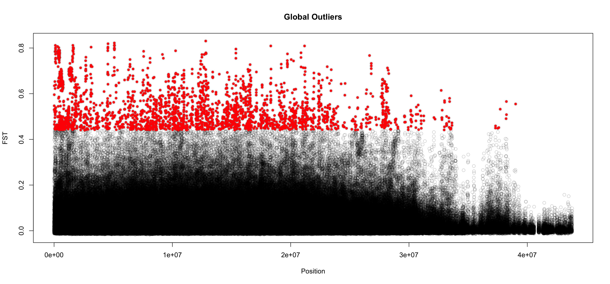
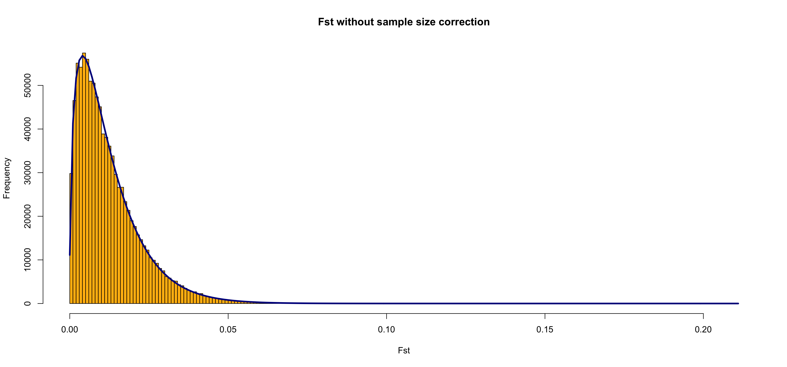
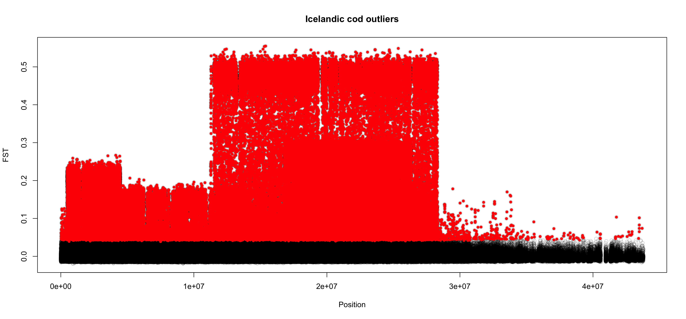
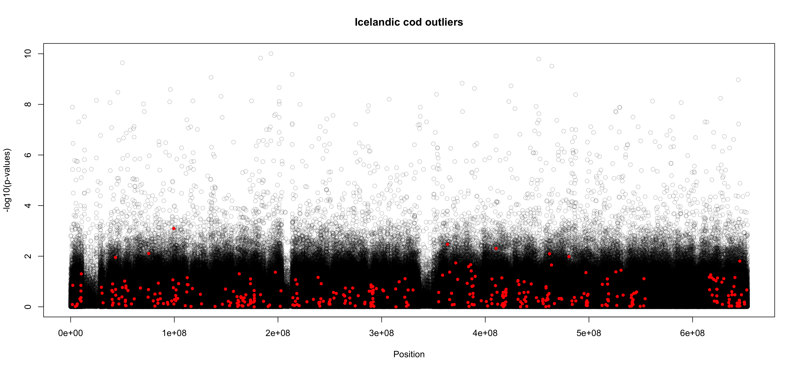
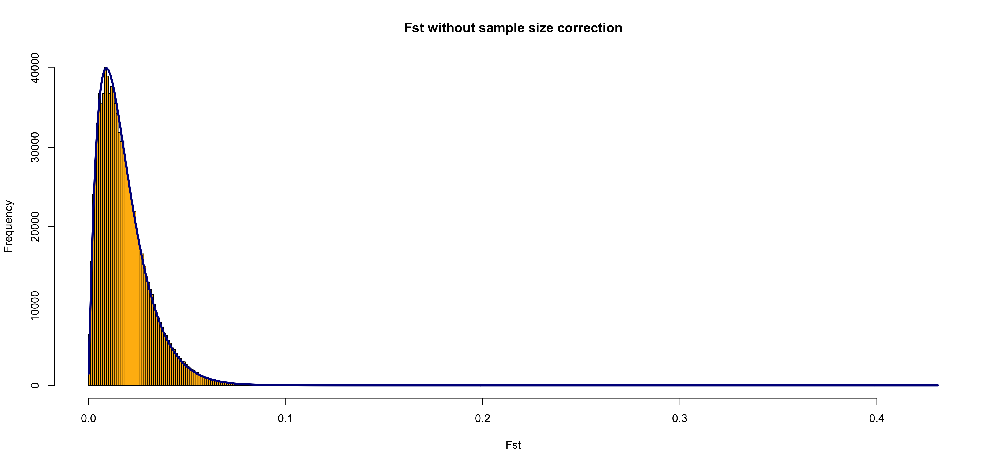
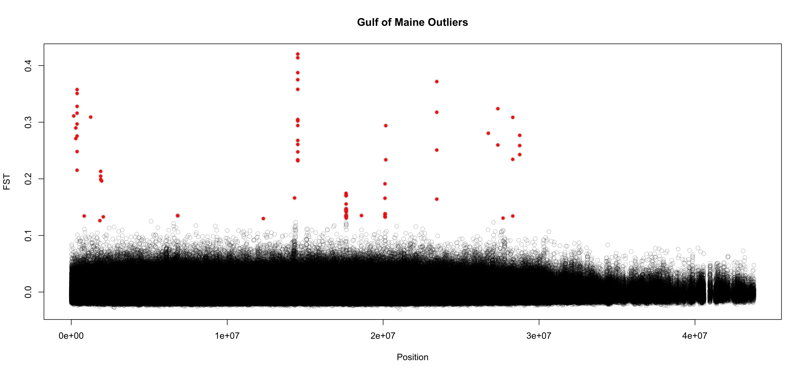
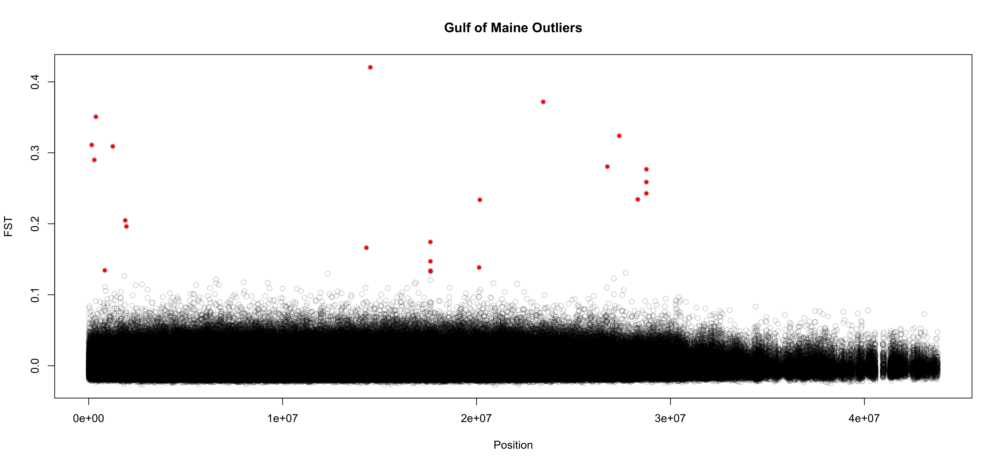
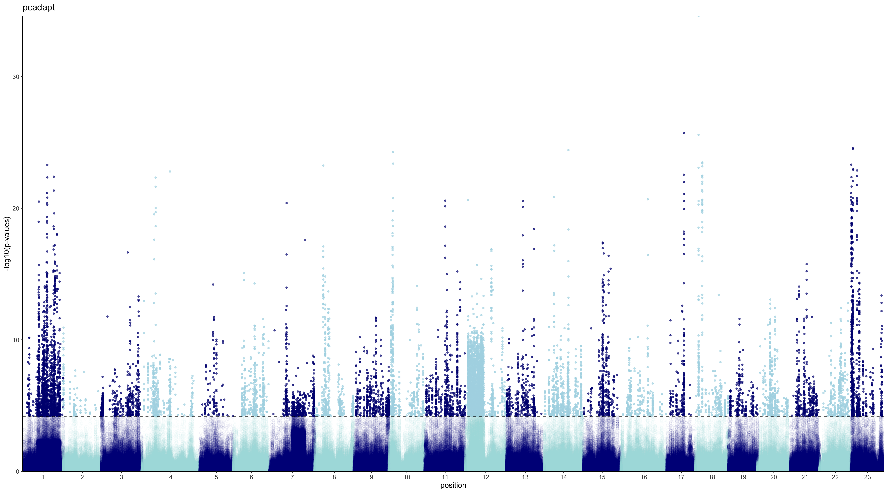

# outlier analysis

For outlier analysis, I first thinned the SNPs using Bigsnpr and Bigstatsr. We started with 2094293 SNPs and after thinning we had 1188248 SNPs. I used the function ```snp_autoSVD``` to thin for long range LD and clumping  (see code below).

## remove SNPs that are in long range LD
```
lrLD <- snp_autoSVD(G=G_full, infos.chr = chrom_full,
                      infos.pos = pos_full, size = 1)
```
The size parameter is the window size around a SNP to compute correlations. I chose size = 1 because this corresponds to 1,000 bp which is what we found was how quickly LD decays from our previous analysis. 

Using the thinned SNPs from the ```snp_autoSVD``` function, I then used two different outlier detection methods on three sets of data: global (all populations), Icelandic cod comparison, and Gulf of Maine cod comparison. 

## outflank
For outflank, we use the thin snps as a quasi-independent set of SNPs to estimate mean FST and degrees of freedom. Then using these estimates we can detect outliers on the full set of SNPs (I'm not sure if this is right I'm getting all sorts of weird results).

### global outliers (full dataset)

```
# global outliers 
  FSTs_full <- MakeDiploidFSTMat(G_mat, locusNames = colnames(G_mat), popNames = rownames(G_mat))
  FSTs <- MakeDiploidFSTMat(G_thin, locusNames = colnames(G_thin), popNames = rownames(G_thin))
  global_out <- OutFLANK(FSTs, NumberOfSamples=295, qthreshold = 0.05, Hmin = 0.1)
  str(global_out)
  png(paste0(folderOut, "outflank_globalOutliers_FstFreq.png"), width = 15, height = 7, units = 'in', res = 300)
    OutFLANKResultsPlotter(global_out, withOutliers = TRUE,
                           NoCorr = TRUE, Hmin = 0.1, binwidth = 0.001, Zoom =
                           FALSE, RightZoomFraction = 0.05, titletext = NULL)
  dev.off()
 
  df.global.outliers.outflank <- pOutlierFinderChiSqNoCorr(FSTs_full, Fstbar = global_out$FSTNoCorrbar, 
                            dfInferred = global_out$dfInferred, qthreshold = 0.05, Hmin=0.1)
  df.global.outliers.thin.outflank <- pOutlierFinderChiSqNoCorr(FSTs, Fstbar = global_out$FSTNoCorrbar, 
                                                  dfInferred = global_out$dfInferred, qthreshold = 0.05, Hmin=0.1)
  
  global.outliers.outflank <- df.global.outliers.outflank$OutlierFlag==TRUE
  global.outliers.thin.outflank <- df.global.outliers.thin.outflank$OutlierFlag==TRUE
  colnames(df.global.outliers.outflank)[1] <- "position"
  df.global.outliers.outflank$position <- as.numeric(df.global.outliers.outflank$position)
  df.plot.global.outflank <- left_join(df.global, df.global.outliers.outflank, by = "position")
  df.plot.global.outflank$OutFLANK_0.2_PRUNED_log10p <- -log10(df.plot.global.outflank$pvaluesRightTail)
  df.plot.global.outflank$OutFLANK_0.2_PRUNED_log10p_add <- -log10(df.plot.global.outflank$pvaluesRightTail + 1/10000000000000000000)
  
  max.global.outflank <- max(df.plot.global.outflank$OutFLANK_0.2_PRUNED_log10p_add[!is.na(df.plot.global.outflank$OutFLANK_0.2_PRUNED_log10p_add)])
  png(paste0(folderOut_outliers, "outflank_globalOutliers.png"), width = 15, height = 7, units = 'in', res = 300)
    plot(df.plot.global.outflank$pos.cumulative, 
         df.plot.global.outflank$OutFLANK_0.2_PRUNED_log10p_add, ylim = c(0,max.global.outflank),
         xlab="Position", ylab="-log10(p-values)", col=rgb(0,0,0,0.2), main = "Global Outliers")
    points(df.plot.global.outflank$pos.cumulative[global.outliers.outflank], 
           df.plot.global.outflank$OutFLANK_0.2_PRUNED_log10p_add[global.outliers.outflank], col="red", pch=20)  
  dev.off()
  
  png(paste0(folderOut, "outflank_globalOutliersThin.png"), width = 15, height = 7, units = 'in', res = 300)
    plot(df.global.outliers.thin$LocusName[df.global.outliers.thin$He>0.1], df.global.outliers.thin$FST[df.global.outliers.thin$He>0.1],
         xlab="Position", ylab="FST", col=rgb(0,0,0,0.2), main = "Global Outliers")
    points(df.global.outliers.thin$LocusName[global.outliers.thin], df.global.outliers.thin$FST[global.outliers.thin], col="red", pch=20)  
  dev.off()
  

```
#### Fst Frequency Distribution
  

#### All SNPs using thin snp set to call outliers
  

#### Thinned SNPs
#  

### Icelandic Cod Outliers 
The inputs that I used in this analysis were first the full G matrix on all \~2,000,000 SNPs for the Icelandic cod popiulations to calculate FSTs (G_mat_ice). I then used the G matrix that resulted from thinning the SNPs from the full Icelandic cod G matrix using the code from ```snp_autoSVD```, where I subset for just the SNPs that are thinned. 
```
 G_mat_ice <- subset(G_mat,  subset = rownames(G_mat) == "Pop6" | rownames(G_mat) == "Pop7" |
                        rownames(G_mat) == "Pop8" | rownames(G_mat) == "Pop9")

 G_ice_coded <- add_code256(big_copy(G_mat_ice,
                                      type = "raw"),
                             code=bigsnpr:::CODE_012)
  
 lrLD.ice <- snp_autoSVD(G=G_ice_coded, infos.chr = chrom_full,
                      infos.pos = pos_full, size = 1)

 lrLD.ice.ind <- attr(lrLD.ice, "subset") # this contains new set of pruned SNPs
 G_thin_ice <- G_mat_ice[,lrLD.ice.ind]

```
 I first calculated outliers on the full set using the estimated mean FST and df from the thinned SNP set. This is the first plot below labeled "Icelandic cod outliers - full set" . This was just exploratory to see what the outlier analysis did without thinning. The second analysis is the thinned snps which should be the figure we want to focus on for publication. However neither are making sense at the moment. 

```
  
  FSTs_mat_ice <- MakeDiploidFSTMat(G_mat_ice, locusNames = colnames(G_mat_ice), popNames = rownames(G_mat_ice))
  ice_out <- OutFLANK(FSTs_mat_ice[lrLD.ice.ind,], NumberOfSamples=158, qthreshold = 0.05, Hmin = 0.1)
  str(ice_out)
  
  png(paste0(folderOut_outliers, "outflank_iceOutliers_FstFreq.png"), width = 15, height = 7, units = 'in', res = 300)
    OutFLANKResultsPlotter(ice_out, withOutliers = TRUE,
                           NoCorr = TRUE, Hmin = 0.1, binwidth = 0.001, Zoom =
                           FALSE, RightZoomFraction = 0.05, titletext = NULL)
  dev.off()
  
  df.ice.outliers.outflank <- pOutlierFinderChiSqNoCorr(FSTs_mat_ice, Fstbar = ice_out$FSTNoCorrbar, 
                                               dfInferred = ice_out$dfInferred, qthreshold = 0.05, Hmin=0.1)
  df.ice.outliers.outflank.thin <- pOutlierFinderChiSqNoCorr(FSTs_ice, Fstbar = ice_out$FSTNoCorrbar, 
                                                    dfInferred = ice_out$dfInferred, qthreshold = 0.05, Hmin=0.1)
  ice.outliers <- df.ice.outliers.outflank$OutlierFlag==TRUE
  ice.outliers.thin <- df.ice.outliers.outflank.thin$OutlierFlag==TRUE
  
  colnames(df.ice.outliers.outflank)[1] <- "position"
  df.ice.outliers.outflank$position <- as.numeric(df.ice.outliers.outflank$position)
  df.plot.ice.outflank <- right_join(df.global, df.ice.outliers.outflank, by = "position")
  df.plot.ice.outflank$OutFLANK_0.2_PRUNED_log10p <- -log10(df.plot.ice.outflank$pvaluesRightTail)
  
  png(paste0(folderOut_outliers, "outflank_iceOutliers.png"), width = 15, height = 7, units = 'in', res = 300)
    plot(df.plot.ice.outflank$pos.cumulative, df.plot.ice.outflank$OutFLANK_0.2_PRUNED_log10p_add,
         xlab="Position", ylab="-log10(p-values)", col=rgb(0,0,0,0.2), main = "Icelandic cod outliers")
    points(df.plot.ice.outflank$pos.cumulative[ice.outliers], df.plot.ice.outflank$OutFLANK_0.2_PRUNED_log10p_add[ice.outliers], col="red", pch=20)  
  dev.off()
  
```
#### Fst Frequency Distribution
  

#### All SNPs
  

#### Thinned SNPs
 

### Gulf of Maine Outliers
Same description for Iceland except these outliers make more sense for what I would have expected in the icelandic cod data. The main thing that might change is a regrouping of the population assignments based on our new groupings after dropping the otolith A1 diameter linear discriminant analysis. 

```
# outliers GOM 
  FSTs_mat_GOM <- MakeDiploidFSTMat(G_mat_GOM, locusNames = colnames(G_mat_GOM), popNames = rownames(G_mat_GOM))
  FSTs_GOM <- MakeDiploidFSTMat(G_thin_GOM, locusNames = colnames(G_thin_GOM), popNames = rownames(G_thin_GOM))
  GOM_out <- OutFLANK(FSTs_GOM, NumberOfSamples=137, qthreshold = 0.05, Hmin = 0.1)
  str(GOM_out)
  
  png(paste0(folderOut, "outflank_GOMOutliers_FstFreq.png"), width = 15, height = 7, units = 'in', res = 300)
    OutFLANKResultsPlotter(GOM_out, withOutliers = TRUE,
                           NoCorr = TRUE, Hmin = 0.1, binwidth = 0.001, Zoom =
                           FALSE, RightZoomFraction = 0.05, titletext = NULL)
  dev.off()
  
  df.GOM.outliers <- pOutlierFinderChiSqNoCorr(FSTs_mat_GOM, Fstbar = GOM_out$FSTNoCorrbar, 
                                               dfInferred = GOM_out$dfInferred, qthreshold = 0.05, Hmin=0.1)
  df.GOM.outliers.thin <- pOutlierFinderChiSqNoCorr(FSTs_GOM, Fstbar = GOM_out$FSTNoCorrbar, 
                                                    dfInferred = GOM_out$dfInferred, qthreshold = 0.05, Hmin=0.1)
  GOM.outliers <- df.GOM.outliers$OutlierFlag==TRUE
  GOM.outliers.thin <- df.GOM.outliers.thin$OutlierFlag==TRUE
  png(paste0(folderOut, "outflank_GOMOutliers.png"), width = 15, height = 7, units = 'in', res = 300)
    plot(df.GOM.outliers$LocusName[df.GOM.outliers$He>0.1], df.GOM.outliers$FST[df.GOM.outliers$He>0.1],
         xlab="Position", ylab="FST", col=rgb(0,0,0,0.2), main = "Gulf of Maine Outliers")
    points(df.GOM.outliers$LocusName[GOM.outliers], df.GOM.outliers$FST[GOM.outliers], col="red", pch=20)  
  dev.off()
  
  png(paste0(folderOut, "outflank_GOMOutliersThin.png"), width = 15, height = 7, units = 'in', res = 300)
    plot(df.GOM.outliers.thin$LocusName[df.GOM.outliers.thin$He>0.1], df.GOM.outliers.thin$FST[df.GOM.outliers.thin$He>0.1],
        xlab="Position", ylab="FST", col=rgb(0,0,0,0.2), main = "Gulf of Maine Outliers")
    points(df.GOM.outliers.thin$LocusName[GOM.outliers.thin], df.GOM.outliers.thin$FST[GOM.outliers.thin], col="red", pch=20)  
  dev.off()
```
#### Fst Frequency Distribution
  

#### All SNPs  
   

#### Thinned SNPs 
 

## Pcadapt

### Code for global outliers
First, we need to convert the position data to be cumulative. The position shifts back to 1 with every chromosome instead of being cumulative across the genome. Then we can calculate outliers and plot a manhattan plot. 
```
 	df.global.outliers <- read.pcadapt(t(G_mat))
    df.glob <- as.data.frame(cbind(pos_full, bigSNP$map$chromosome))
    colnames(df.glob) <- c("position", "chrom")
    df.glob$position <- as.numeric(df.glob$position)

    chrom.info <- df.glob %>%
                    group_by(chrom) %>%
                    summarize(center=(max(position) + min(position)) / 2, final = max(position))
    
    df.chrom.info <- as.data.frame(chrom.info)
    df.chrom.info$chrom_num <- 1:23
    df.chrom.info$chrom.cumulative <- cumsum(df.chrom.info$final)
    df.chrom.info$center.cumulative <- df.chrom.info$chrom.cumulative - df.chrom.info$center
    df.chrom.info$add.value <- c(0, df.chrom.info$chrom.cumulative[1:(nrow(df.chrom.info)-1)])
    df.global <- left_join(df.glob, df.chrom.info, by = "chrom")
    
    df.global$pos.cumulative <- df.global$position + df.global$add.value
    
    global.outliers <- pcadapt(df.global.outliers, K = 5)
    df.global$pca_ALL_PC1 <- global.outliers$loadings[,1]
    df.global$pca_ALL_PC2 <- global.outliers$loadings[,2]
    plot(global.outliers, option = "screeplot")
  
    folderOut_outliers <- "./Figures/Outliers/"
    png(paste0(folderOut_outliers, "pcadapt_globalOutliers.png"), width = 15, height = 7, units = 'in', res = 300)
      plot(global.outliers)
    dev.off()

  # thinned SNPs run pcadapt
    df.global.outliers.thin <- read.pcadapt(t(G_thin))
    global.outliers.thin.pcadapt <- pcadapt(df.global.outliers.thin)
    df.global$pca_PRUNED_PC1 <- NA 
    df.global$pca_PRUNED_PC2 <- NA
    df.global$pca_PRUNED_PC1[lrLD.ind] <- global.outliers.thin.pcadapt$loadings[,1]
    df.global$pca_PRUNED_PC2[lrLD.ind] <- global.outliers.thin.pcadapt$loadings[,2] 
    
    
  # outlier stats 
    # all data
    df.global$pcadapt_ALL_chisq <- as.numeric(global.outliers$chi2.stat)
    df.global$pcadapt_ALL_log10p <- -log10(global.outliers$pvalues)
    
    # thinned SNPs
    outliers <- snp_gc(snp_pcadapt(G_coded, U.row = lrLD$u[,1]))
    df.global$pcadapt_PRUNED_log10p <- -predict(outliers,log10=T)
    df.global$pcadapt_PRUNED_pvalue <- 10^(-df.global$pcadapt_PRUNED_log10p)
    df.global$qvalue <- qvalue(df.global$pcadapt_PRUNED_pvalue)$qvalues  
    df.global$pcadapt_outlier <- ifelse(df.global$qvalue > 0.01, FALSE, TRUE)
    df.global$pcadapt_outlier <- as.factor(df.global$pcadapt_outlier)
    
    
    # plot
    max_value_log10 <- max(df.global$pcadapt_ALL_log10p[!is.na(df.global$pcadapt_PRUNED_log10p)])
    df.global$chrom_num <- as.factor(df.global$chrom_num)
    row.indexes <- sample(1:nrow(df.global), size = 10000)
    df.prac <- df.global[row.indexes,]
    
    pcadapt.log10p <- ggplot(df.global, aes(x = pos.cumulative, y = pcadapt_PRUNED_log10p)) +
      geom_point(data = df.global[!is.na(df.global$pcadapt_outlier),], 
                 aes(color = chrom_num, shape = pcadapt_outlier, alpha = pcadapt_outlier)) +
      scale_color_manual(values = c(rep(c("navy", "lightblue"), 11), "navy")) +
      scale_shape_manual(values = c(1, 20)) +
      scale_alpha_manual(values = c(0.05,0.7)) +
      geom_hline(yintercept = 4.2, linetype = "dashed") +
      theme_classic() +
      theme(panel.background = element_blank(), 
            strip.background = element_rect(colour = "white", fill = "grey92"),
            text = element_text(size = 11)) +
      labs(title = "pcadapt",
           y = "-log10(p-values)",
           x = "position")  +
      scale_x_continuous(expand = c(0,0), label = df.chrom.info$chrom_num, breaks = df.chrom.info$center.cumulative) +
      scale_y_continuous(expand = c(0, 0))
    png(paste0(folderOut_outliers, "pcadapt_globalOutliersThinned.png"), width = 18, height = 10, units = 'in', res = 300) 
      pcadapt.log10p + theme(legend.position = "none")
    dev.off()
```
#### Global Outliers 
  

#### Icelandic Cod Outliers
These population specific analyses aren't working. The global outliers looks how I would expect and I've got the code written to make nice manhattan plots once I get this working, but I can't figure out what is happening with these analyses.

When I get to the call outliers steps I get an error.

```
# Iceland cod outlier analysis
  G_mat_ice <- subset(G_mat,  subset = rownames(G_mat) == "Pop6" | rownames(G_mat) == "Pop7" |
                        rownames(G_mat) == "Pop8" | rownames(G_mat) == "Pop9")
  G_ice_coded <- add_code256(big_copy(G_mat_ice,
                                      type = "raw"),
                             code=bigsnpr:::CODE_012)
  
  lrLD.ice <- snp_autoSVD(G=G_ice_coded, infos.chr = chrom_full,
                      infos.pos = pos_full, size = 1)
  
  str(lrLD.ice)
  lrLD.ice.ind <- attr(lrLD.ice, "subset") # this contains new set of pruned SNPs
  length(lrLD.ice.ind) 
  length(G_mat_ice[lrLD.ice.ind])
  G_thin_ice <- G_mat_ice[,lrLD.ice.ind]
  colnames(G_thin_ice) <- bigSNP$map$physical.pos[lrLD.ice.ind]
  rownames(G_thin_ice) <- rownames(G_mat_ice)
  lrLD.ice.tb <- attr(lrLD.ice, "lrldr")
  sum(is.na(G_mat_ice[1:nrow(G_mat_ice),1:ncol(G_mat_ice)]))
  
  df.ice.out <- read.pcadapt(t(G_mat_ice))
  
  ## information to get correct positions
  df.ice.outliers <- left_join(df.glob, df.chrom.info, by = "chrom")
  df.ice.outliers$pos.cumulative <- df.ice.outliers$position + df.ice.outliers$add.value
  
  #  run pcadapt on full g matrix
  ice.outliers <- pcadapt(df.ice.out, K = 2)
  plot(ice.outliers, option = "screeplot")
  
  df.ice.outliers$pca_ALL_PC1 <- ice.outliers$loadings[,1]
  df.ice.outliers$pca_ALL_PC2 <- ice.outliers$loadings[,2]
  
  # run pcadapt on thinned SNPs run pcadapt
  df.ice.out.thin <- read.pcadapt(t(G_thin_ice))
  ice.outliers.thin.pcadapt <- pcadapt(df.ice.out.thin, K = 2)
  df.ice.outliers$pca_PRUNED_PC1 <- NA 
  df.ice.outliers$pca_PRUNED_PC2 <- NA
  df.ice.outliers$pca_PRUNED_PC1[lrLD.ice.ind] <- ice.outliers.thin.pcadapt$loadings[,1]
  df.ice.outliers$pca_PRUNED_PC2[lrLD.ice.ind] <- ice.outliers.thin.pcadapt$loadings[,2] 
  
  # outlier stats 
  # all data
  df.ice.outliers$pcadapt_ALL_chisq <- as.numeric(ice.outliers$chi2.stat)
  df.ice.outliers$pcadapt_ALL_log10p <- -log10(ice.outliers$pvalues)
  
  # thinned SNPs
  rownames(lrLD$u) <- bigSNP$fam$family.ID
  lrLD.ice <- subset(lrLD$u,  subset = rownames(lrLD$u) == "Pop6" | rownames(lrLD$u) == "Pop7" |
           rownames(lrLD$u) == "Pop8" | rownames(lrLD$u) == "Pop9")
  rownames(lrLD.ice) <- NULL
 
  ice.outliers <- snp_gc(snp_pcadapt(G_ice_coded, U.row = lrLD.ice[,1]))
    Error in doTryCatch(return(expr), name, parentenv, handler) : 
      invalid 'xmin' value
    In addition: Warning messages:
    1: In min(x) : no non-missing arguments to min; returning Inf
    2: In max(x) : no non-missing arguments to max; returning -Inf

  sum(is.na(lrLD.ice$u[,1])) # checked that there aren't NAs


```

#### GOM Outliers


