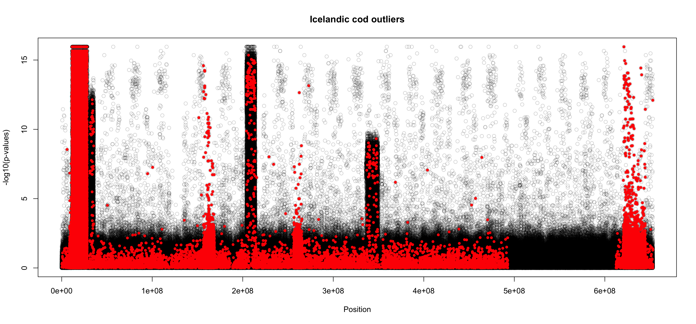
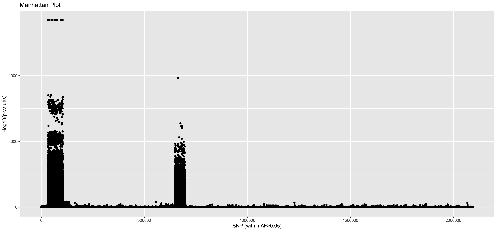

# outlier analysis

For outlier analysis, I first thinned the SNPs using Bigsnpr and Bigstatsr. We started with 2094293 SNPs and after thinning we had 1188248 SNPs. I used the function ```snp_autoSVD``` to thin for long range LD and clumping  (see code below).

## remove SNPs that are in long range LD
```
lrLD <- snp_autoSVD(G=G_full, infos.chr = chrom_full,
                      infos.pos = pos_full, size = 1)
```
The size parameter is the window size around a SNP to compute correlations. I chose size = 1 because this corresponds to 1,000 bp which is what we found was how quickly LD decays from our previous analysis. 

Using the thinned SNPs from the ```snp_autoSVD``` function, I then used two different outlier detection methods on three sets of data: global (all populations), Icelandic cod comparison, and Gulf of Maine cod comparison. 

## outflank
For outflank, we use the thin snps as a quasi-independent set of SNPs to estimate mean FST and degrees of freedom. Then using these estimates we can detect outliers on the full set of SNPs (I'm not sure if this is right I'm getting all sorts of weird results).

### global outliers (full dataset)


### icelandic cod outliers 
The inputs that I used in this analysis were first the full G matrix on all \~2,000,000 SNPs for the Icelandic cod popiulations to calculate FSTs (G_mat_ice). I also used the G matrix that resulted from thinning the SNPs using the code from ```snp_autoSVD``` where I subsetted that for just the icelandic cod samples (G_thin_ice) and calculated FSTs based on that full set. I first calculated outliers on the full set using the estimated mean FST and df from the thinned SNP set. This is the first plot below labeled "Icelandic cod outliers - full set" . Then because this looked very off, I tried looking at just the thinned set of SNPs, but this also doesn't look how I would expect. 

```
  FSTs_mat_ice <- MakeDiploidFSTMat(G_mat_ice, locusNames = colnames(G_mat_ice), popNames = rownames(G_mat_ice))
  FSTs_ice <- MakeDiploidFSTMat(G_thin_ice, locusNames = colnames(G_thin_ice), popNames = rownames(G_thin_ice))
  ice_out <- OutFLANK(FSTs_ice, NumberOfSamples=158, qthreshold = 0.05, Hmin = 0.1)
  str(ice_out)
  png(paste0(folderOut, "outflank_iceOutliers_FstFreq.png"), width = 15, height = 7, units = 'in', res = 300)
  OutFLANKResultsPlotter(ice_out, withOutliers = TRUE,
                         NoCorr = TRUE, Hmin = 0.1, binwidth = 0.001, Zoom =
                           FALSE, RightZoomFraction = 0.05, titletext = NULL)
  dev.off()
  df.ice.outliers <- pOutlierFinderChiSqNoCorr(FSTs_mat_ice, Fstbar = ice_out$FSTNoCorrbar, 
                                               dfInferred = ice_out$dfInferred, qthreshold = 0.05, Hmin=0.1)
  df.ice.outliers.thin <- pOutlierFinderChiSqNoCorr(FSTs_ice, Fstbar = ice_out$FSTNoCorrbar, 
                                                    dfInferred = ice_out$dfInferred, qthreshold = 0.05, Hmin=0.1)
  ice.outliers <- df.ice.outliers$OutlierFlag==TRUE
  ice.outliers.thin <- df.ice.outliers.thin$OutlierFlag==TRUE
  png(paste0(folderOut, "outflank_iceOutliers.png"), width = 15, height = 7, units = 'in', res = 300)
    plot(df.ice.outliers$LocusName[df.ice.outliers$He>0.1], df.ice.outliers$FST[df.ice.outliers$He>0.1],
         xlab="Position", ylab="FST", col=rgb(0,0,0,0.2), main = "Icelandic cod outliers")
    points(df.ice.outliers$LocusName[ice.outliers], df.ice.outliers$FST[ice.outliers], col="red", pch=20)  
  dev.off()
  
  png(paste0(folderOut, "outflank_iceOutliersThin.png"), width = 15, height = 7, units = 'in', res = 300)
    plot(df.ice.outliers.thin$LocusName[df.ice.outliers.thin$He>0.1], df.ice.outliers.thin$FST[df.ice.outliers.thin$He>0.1],
        xlab="Position", ylab="FST", col=rgb(0,0,0,0.2), main = "Icelandic cod outliers")
    points(df.ice.outliers.thin$LocusName[ice.outliers.thin], df.ice.outliers.thin$FST[ice.outliers.thin], col="red", pch=20)  
  dev.off()
```
  
 

### Gulf of Maine Outliers
Same description for Iceland except these outliers make more sense for what I would have expected in the icelandic cod data. The main thing that might change is a regrouping of the population assignments based on our new groupings after dropping the otolith A1 diameter linear discriminant analysis. 

```
# outliers GOM 
  FSTs_mat_GOM <- MakeDiploidFSTMat(G_mat_GOM, locusNames = colnames(G_mat_GOM), popNames = rownames(G_mat_GOM))
  FSTs_GOM <- MakeDiploidFSTMat(G_thin_GOM, locusNames = colnames(G_thin_GOM), popNames = rownames(G_thin_GOM))
  GOM_out <- OutFLANK(FSTs_GOM, NumberOfSamples=137, qthreshold = 0.05, Hmin = 0.1)
  str(GOM_out)
  OutFLANKResultsPlotter(GOM_out, withOutliers = TRUE,
                         NoCorr = TRUE, Hmin = 0.1, binwidth = 0.001, Zoom =
                           FALSE, RightZoomFraction = 0.05, titletext = NULL)
  df.GOM.outliers <- pOutlierFinderChiSqNoCorr(FSTs_mat_GOM, Fstbar = GOM_out$FSTNoCorrbar, 
                                               dfInferred = GOM_out$dfInferred, qthreshold = 0.05, Hmin=0.1)
  df.GOM.outliers.thin <- pOutlierFinderChiSqNoCorr(FSTs_GOM, Fstbar = GOM_out$FSTNoCorrbar, 
                                                    dfInferred = GOM_out$dfInferred, qthreshold = 0.05, Hmin=0.1)
  GOM.outliers <- df.GOM.outliers$OutlierFlag==TRUE
  GOM.outliers.thin <- df.GOM.outliers.thin$OutlierFlag==TRUE
  png(paste0(folderOut, "outflank_GOMOutliers.png"), width = 15, height = 7, units = 'in', res = 300)
    plot(df.GOM.outliers$LocusName[df.GOM.outliers$He>0.1], df.GOM.outliers$FST[df.GOM.outliers$He>0.1],
         xlab="Position", ylab="FST", col=rgb(0,0,0,0.2), main = "Gulf of Maine Outliers")
    points(df.GOM.outliers$LocusName[GOM.outliers], df.GOM.outliers$FST[GOM.outliers], col="red", pch=20)  
  dev.off()
  
  png(paste0(folderOut, "outflank_GOMOutliersThin.png"), width = 15, height = 7, units = 'in', res = 300)
    plot(df.GOM.outliers.thin$LocusName[df.GOM.outliers.thin$He>0.1], df.GOM.outliers.thin$FST[df.GOM.outliers.thin$He>0.1],
        xlab="Position", ylab="FST", col=rgb(0,0,0,0.2), main = "Gulf of Maine Outliers")
    points(df.GOM.outliers.thin$LocusName[GOM.outliers.thin], df.GOM.outliers.thin$FST[GOM.outliers.thin], col="red", pch=20)  
  dev.off()
```

  
 

## pcadapt

The outliers are confusing. I would have still expected some clusters of outliers in the inverted regions for some of these analysis. I tried pcadapt just on the thinned SNPs and am now updating the code to use the thinned estimation on the full set like I did for outflank.  

```
df.global.outliers <- read.pcadapt(t(G_thin))
global.outliers <- pcadapt(df.global.outliers, K = 5) # 5 chosen based on screeplot made with K = 10
plot(global.outliers, option = "screeplot")
plot(global.outliers)
```

  
  
  

